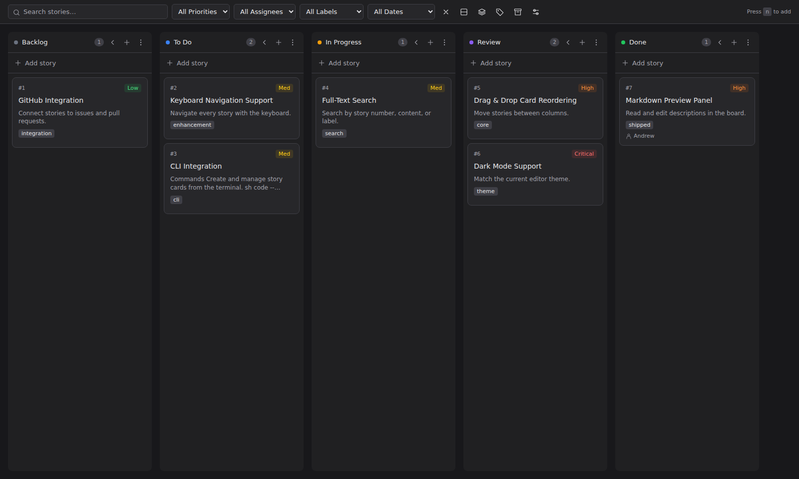
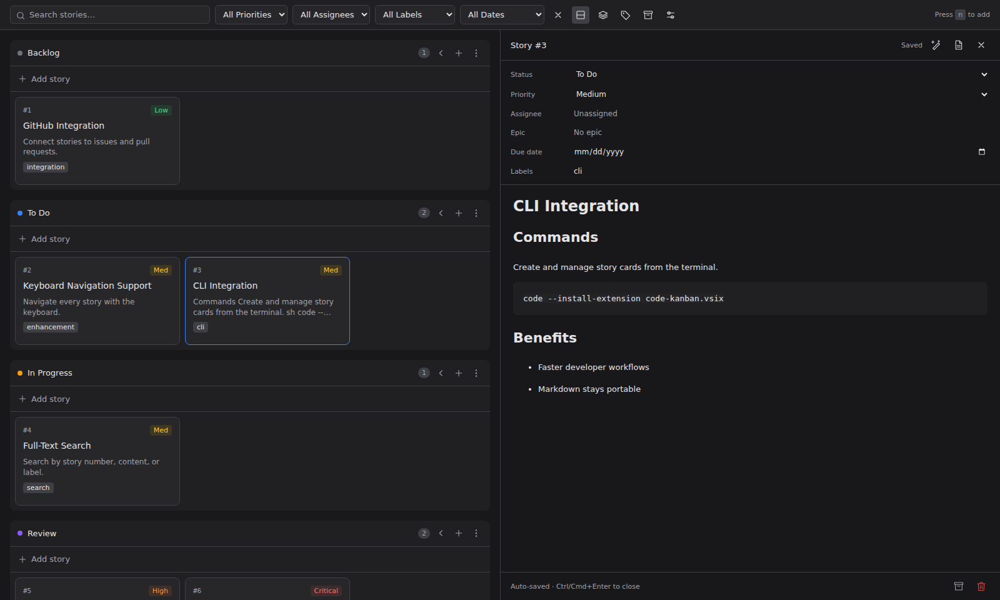

# Code Kanban

A VS Code kanban board with permanent, numbered story cards. Built with vanilla
JavaScript; no React or TypeScript source. The board opens in its own editor tab.
The layout and interactions are based on [Kanban Markdown](https://github.com/LachyFS/kanban-markdown-vscode-extension).



## Run it

```sh
npm ci
npm run build
```

Open this repository in VS Code and press **F5**. In the Extension Development
Host, open a repository folder and run **Code Kanban: Open Kanban Board** from the
command palette. Press **N** or a column's **+** button to create a story.

To install locally:

```sh
npm run package
code --install-extension code-kanban-0.1.0.vsix
```

## Board

- Backlog, To Do, In Progress, Review, Done; editable column names and colors.
- Drag cards between columns or onto another card to insert before it.
- Search content, story numbers, assignees, labels, and epics; filter by priority,
  assignee, label, or due date.
- Horizontal and vertical layouts, compact cards, collapsed columns, epic lanes.
- Split rich-text editor with Markdown shortcuts and automatic saving of existing
  stories. New stories save on closing the editor or pressing Ctrl/Cmd+Enter.
- Priorities, labels, assignees, due dates, epics, timestamps, and archive/restore.
- Delete with undo. Deleted cards are retained as Markdown with `deleted: true`.
- Native Markdown editing and refresh when files change externally.
- **Build with AI** starts an installed Claude, Codex, Copilot, or OpenCode CLI
  with the story prompt and normal CLI permissions, or copies the prompt.
- Light, dark, and high-contrast VS Code themes.



## Storage and numbering

All board data lives under **`ExtensionContext.storageUri`**:

```text
<storageUri>/repositories/<workspace-folder-hash>/
  board.json
  STORY-0001.md
  STORY-0002.md
```

Each workspace folder has a separate board and sequence starting at **#1**.
Multi-root workspaces prompt for the folder. Board settings and the sequence
counter are stored in `board.json`; the repository working tree is untouched.
Numbers never change when cards move, change title, are archived, or are deleted.
Writes use atomic replacement and a cross-process lock. A stale editor cannot
silently overwrite a file changed outside it.

VS Code scopes `storageUri` to the workspace. Opening the same repository through
a different `.code-workspace` file can therefore produce a separate board.
Storage is local to that VS Code workspace, not committed or synchronized by Git.
Use the editor's **Open Markdown file** action to access a story and its directory;
back up that directory to preserve the board.

```markdown
---
number: 1
status: todo
priority: medium
assignee: Andrew
epic: null
dueDate: null
labels: [enhancement]
order: 1
archived: false
deleted: false
created: 2026-09-15T00:00:00.000Z
modified: 2026-09-15T00:00:00.000Z
completedAt: null
---

# My first story

Describe the desired behavior here.
```

Keep the number and filename consistent when editing files manually. Unknown
frontmatter fields are preserved. Malformed files are reported rather than
silently replaced. Rich-text editing normalizes Markdown formatting; metadata-only
edits retain the original body.

## Development

```sh
npm test                      # persistence, numbering, conflicts, isolation
npx playwright install chromium
npm run build
npm run test:ui                # real Chromium UI + real temporary Markdown store
npm run package               # build a self-contained VSIX
```

The UI tests use a VS Code message bridge substitute and the production storage
layer. They do not run inside the VS Code extension host. No external service or
network access is needed by the board itself. Desktop VS Code / remote extension
hosts are supported; this is not a browser-only vscode.dev extension.

MIT licensed. See [NOTICE](NOTICE) for reference-project attribution.
